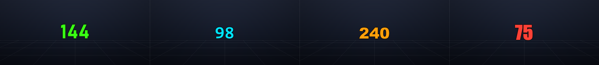

# Minimal FPS Overlay

A tiny, minimalistic, completely free FPS counter. Auto-detects whatever
game window is in focus and shows real frame-timing FPS (not an
estimate) as a bare, centered, whole number — nothing else is ever
drawn on screen. When no game is being measured it shows "0", so the
counter is always visible and ready to be moved or restyled.

**Windows only** — it relies on PresentMon, which uses a Windows-only
tracing mechanism (ETW) to read real frame Present() timings straight
from the OS/GPU driver. No injection into your game, no code changes to
your game — same technique CapFrameX and similar tools use.

## Screenshots

A bare bold number with a thin black outline — readable over any game
scene. Some font/color combinations (simulated renders of exactly what
the overlay draws; regenerate anytime with
`python tools/make_screenshots.py`):

<p align="center">
  
</p>

<table>
  <tr>
    <td align="center"><br><sub>Bahnschrift · neon green (default)</sub></td>
    <td align="center"><br><sub>Consolas · red</sub></td>
    <td align="center"><br><sub>Arial Black · cyan</sub></td>
  </tr>
  <tr>
    <td align="center"><br><sub>Impact · orange</sub></td>
    <td align="center"><br><sub>Segoe UI · white</sub></td>
    <td align="center"><br><sub>Franklin Gothic · magenta</sub></td>
  </tr>
</table>

Install the free Google Fonts (Orbitron, Rajdhani, Chakra Petch…) and
they appear in the right-click menu too.

## Setup (one time)

1. **Python 3.10+** on Windows (from python.org — tick "Add to PATH" during install).

2. **Install dependencies**, from a normal (non-admin) terminal in this folder:
   ```
   pip install -r requirements.txt
   ```

3. **Download PresentMon** and put the `.exe` in this same folder
   (right next to `main.py`):
   https://github.com/GameTechDev/PresentMon/releases/download/v2.5.1/PresentMon-2.5.1-x64.exe

   (It's Intel/Microsoft's open-source frame-capture tool, MIT licensed.
   `find_presentmon_exe()` in `fps_worker.py` just looks for any
   `PresentMon*.exe` in this folder, so newer versions work too.)

## Running it (standalone .exe)

`dist\FpsOverlay.exe` is a single portable file — **PresentMon is bundled
inside it** and gets extracted to a temp folder automatically at launch,
so there's nothing else to download or install. Double-click it, accept
the Administrator prompt (needed to read frame timings), and the counter
appears showing "0".

- `config.json` (your settings) and `fps_overlay.log` (status messages,
  since there's no console window) are created next to the .exe.
- Windows SmartScreen / Defender may warn about it because the exe is
  unsigned — click "More info" → "Run anyway".

### Rebuilding the exe yourself

Requires Python 3.10+ with `pip install -r requirements.txt pyinstaller`,
then just run:

```
build.bat
```

That produces a fresh `dist\FpsOverlay.exe` (onefile, no console,
requests admin on launch, your icon.ico, PresentMon embedded).

## Running it from source

PresentMon needs to read frame events from other processes, which
requires **Administrator** privileges:

1. Open Command Prompt or PowerShell **as Administrator**.
2. `cd` into this folder.
3. `python main.py`

A small transparent counter showing "0" appears in the top-left corner.
Alt-tab into any game and it starts tracking automatically; when the
game closes it drops back to "0".

## Using it

- **Drag** it anywhere with left-click.
- **Mouse wheel** over the counter grows/shrinks the font one point at
  a time (8–200).
- **Right-click** it to open the settings menu:
  - **Text color...** — any color, saved instantly.
  - **Font** — a curated list of fonts that suit an FPS counter
    (Orbitron, Rajdhani, Chakra Petch, Audiowide, Exo 2, Teko,
    Bebas Neue, Press Start 2P, plus Windows built-ins like Bahnschrift
    and Consolas). The esports/sci-fi ones are free Google Fonts — they
    only show up in the menu once you've installed the TTFs on Windows;
    everything in the "built into Windows" group is always available.
  - **Font size** — quick presets.
  - **Start with Windows** — toggle; creates a Task Scheduler job so the
    counter launches (elevated, silently) every time you log in — no UAC
    prompt at boot.
  - **Exit** — closes the overlay.

All settings (color, font, size, position) are saved to `config.json`
the moment you change them and remembered next launch.

## If nothing appears

When there's no game to measure, the counter shows "0" — that's the
*normal* idle state, not an error. If a game is running and it's stuck
on "0", check the terminal window — status messages (below) print there
instead of on screen, since you didn't want any text over your game:

- **"Run as Administrator"** — you launched `python main.py` from a
  non-elevated terminal. Reopen the terminal as Administrator.
- **"PresentMon .exe missing"** — the setup step above wasn't done, or
  the exe isn't directly in this folder.
- **"Waiting for a game..."** — nothing is in focus that PresentMon can
  track yet (e.g. you're on the desktop). Alt-tab into your game.

If the terminal shows `Tracking <game>.exe` but the counter is still
stuck on "0", your game is very likely running in **exclusive fullscreen**
mode rather than borderless/windowed fullscreen. Exclusive fullscreen
takes over the display directly and bypasses Windows' compositor
entirely, so *no* overlay — not this one, not Discord's, not Steam's —
can draw on top of it without hooking directly into the game's
rendering pipeline (what RTSS does, and a much more invasive technique
than this project uses). Switching the game's display mode to
Borderless or Windowed Fullscreen in its video settings fixes this.

